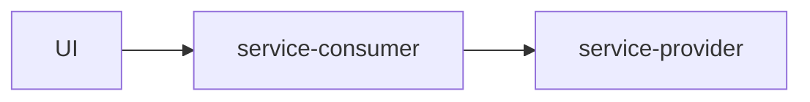

# User Authentication Project

## 目的

以下の構成で、OAuth2UserTokenExchangeによるprovider-serviceへの接続を確認する。



## 実装のポイント

### 1. uaa.userスコープの追加（OAuth2UserTokenExchangeの場合）

UIとservice-consumerの`xs-security.json`に以下の設定を追加する。

**重要な注意点:**
- ユーザーにこのロールテンプレートを使用したロールコレクションを割り当てる必要はない
- この設定はOAuth2UserTokenExchangeのために必要
- OAuth2JWTBearerを使用する場合は不要

```json
{
  "scopes": [],
  "attributes": [],
  "role-templates": [
    {
      "name": "Token_Exchange",
      "description": "UAA",
      "scope-references": [
        "uaa.user"
      ]
    }
  ]
}
```

### 2. service-consumerのapplication.yaml設定

cloud profileに以下の設定を追加する。

**トラブルシューティング:**
- この設定がない場合、`Failed to create cache key for HttpClient`というエラーが発生する
- 詳細はNote 3625274を参照

```yaml
---
spring:
  config:
    activate:
      on-profile: cloud
cds:
  security:
    authentication:
      normalizeProviderTenant: false
```